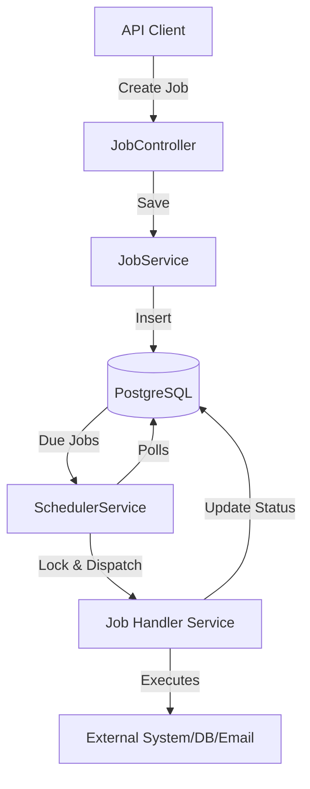

# NestJS Persistent Job Scheduler

Welcome! This project is a real-world, modular job scheduler built with NestJS and PostgreSQL. It's designed to be easy to extend, robust, and a great learning resource for anyone interested in backend scheduling, cron jobs, and scalable architecture.

---

## 🚀 What's Inside?

- **Persistent jobs**: All jobs are stored in a PostgreSQL database, so nothing gets lost if your app restarts.
- **Flexible scheduling**: Use cron expressions for both recurring and one-time jobs.
- **No double work**: Built-in locking ensures no two workers ever run the same job at the same time.
- **Do-anything jobs**: Jobs can be anything—send emails, clean up data, generate reports, you name it.
- **Easy to extend**: The code is organized by feature, so adding new job types is a breeze.
- **Beautiful API docs**: Full Swagger/OpenAPI docs are available at `/api`.

---

## 🏗️ How the Project is Organized

```
src/
  ├── jobs/         # Everything about jobs: entity, service, controller, module
  ├── scheduler/    # The scheduler service and its module
  ├── email/        # Email sending service and module
  ├── cleanup/      # Data cleanup service and module
  ├── report/       # Report generation service and module
  ├── common/       # (for any shared utilities)
  ├── app.module.ts # The main app module
  ├── main.ts       # Entry point (also sets up Swagger)
  ├── app.controller.ts, app.service.ts # Basic health check
```

---

## 📝 Prerequisites

Before you start, make sure you have:

- **Node.js** (v16 or higher recommended)
- **npm** (comes with Node.js)
- **PostgreSQL** (running locally or accessible remotely)
- (Optional) **SMTP server credentials** if you want to test real email jobs (e.g., Gmail, Mailtrap, SendGrid, etc.)

---

## 🛠️ Getting Started

1. **Install dependencies**
   ```bash
   npm install
   ```
2. **Set up your environment**

   - Copy and edit `.env`:

     ```env
     # PostgreSQL
     DB_HOST=localhost
     DB_PORT=5432
     DB_USER=postgres
     DB_PASS=postgres
     DB_NAME=jobscheduler

     # SMTP (for real email sending)
     SMTP_HOST=smtp.example.com
     SMTP_PORT=587
     SMTP_USER=your_smtp_user
     SMTP_PASS=your_smtp_password
     SMTP_FROM="Job Scheduler" <no-reply@example.com>
     ```

3. **Start the app**
   ```bash
   npm run start
   ```
4. **Explore the API**
   - Open [http://localhost:3000/api](http://localhost:3000/api) in your browser for interactive docs and testing.

---

## 🔄 How Does It Work?

1. **You create a job** using the API, specifying what to do, when, and any extra info (like email details).
2. **The scheduler service** wakes up every minute (or as you configure), checks for jobs that are due, and locks them so only one worker can run them.
3. **The right handler runs**: Based on the job type, the scheduler calls the right service (send email, clean up, generate report, etc.), passing along your metadata.
4. **Status is updated**: The job's status and last run time are updated. If it's recurring, it's set up to run again next time.
5. **No double execution**: Thanks to database-level locking, even if you scale out to multiple servers, each job only runs once per schedule.

### Visual Flow



---

## 📚 My Learnings

Building a persistent job scheduler taught me how to:

- **Decide when to run a job** using cron expressions for flexible scheduling.
- **Support recurring jobs** and handle their re-execution automatically.
- **Track the last execution time** of each job for monitoring and scheduling.
- **Store and update the status** of each job (pending, running, completed, failed).
- **Implement a locking mechanism** so only one worker can pick up a job at a time, preventing duplicate execution.
- **Design jobs to be generic**, so the scheduler can handle any type of task.
- **Use a metadata column** to store extra information for each job, making the system flexible.
- **Handle recurring jobs** by resetting their status after execution.
- **Use cron-based polling** (not setTimeout) to pick up and execute jobs reliably.

---

## 🧩 Want to Add More?

- Just create a new service for your job type, register it in the scheduler, and you're good to go!
- Add new API endpoints or metadata fields as your use case grows.

---

## 📝 Example: Creating a Job

Here's what a job to send an email might look like:

```json
{
  "name": "sendEmail",
  "schedule": "*/5 * * * * *",
  "isRecurring": false,
  "metadata": {
    "to": "user@example.com",
    "subject": "Hello",
    "body": "This is a test email"
  }
}
```

---

## 🤝 Contributing

Pull requests and suggestions are always welcome! If you have ideas for new job types or improvements, let's make it better together.

---

## 📄 License

MIT — use it, learn from it, and build something awesome!
